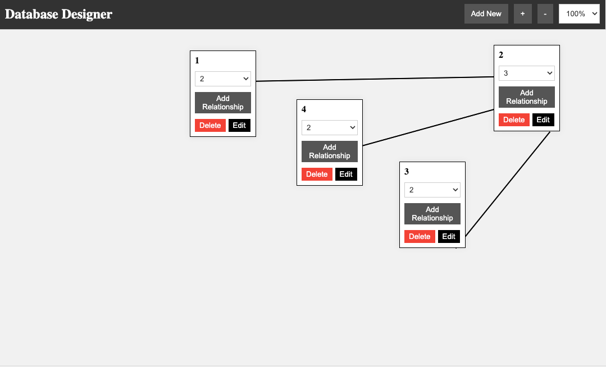
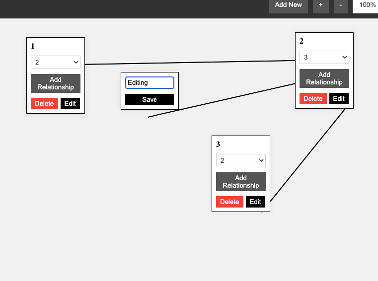
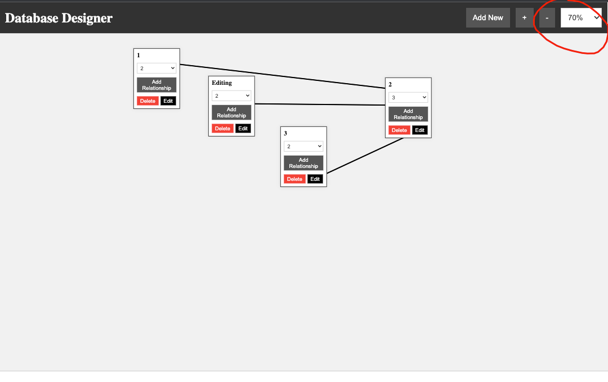
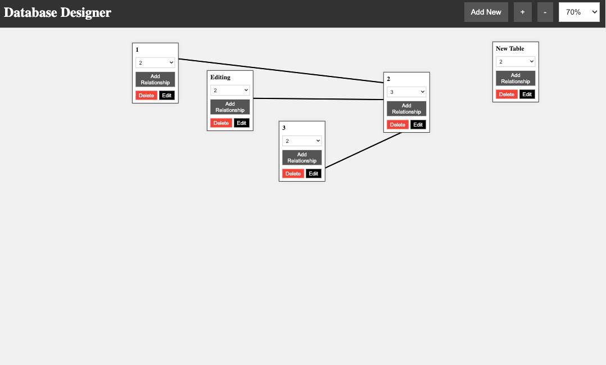

# Getting Started with Create React App

This project was bootstrapped with [Create React App](https://github.com/facebook/create-react-app).

## Available Scripts

In the project directory, you can run:

### `yarn install` 

####  and then

### `yarn start`

Runs the app in the development mode.\
Open [http://localhost:3000](http://localhost:3000) to view it in the browser.

The page will reload if you make edits.\
You will also see any lint errors in the console.

### `yarn build` for building

## Total view.

## Editing.

## Zoom in Zoom out.

## Adding new.

# Developed by [Murad Narimanli]( https://www.linkedin.com/in/murad-n%C9%99rimanl%C4%B1-549389130/ ) 

### Write me on
## Telegram:  [@Murad235]( https://www.t.me/Murad235 )
## Whatsapp:  [MuradN]( https://www.wa.me/994556230599 )
